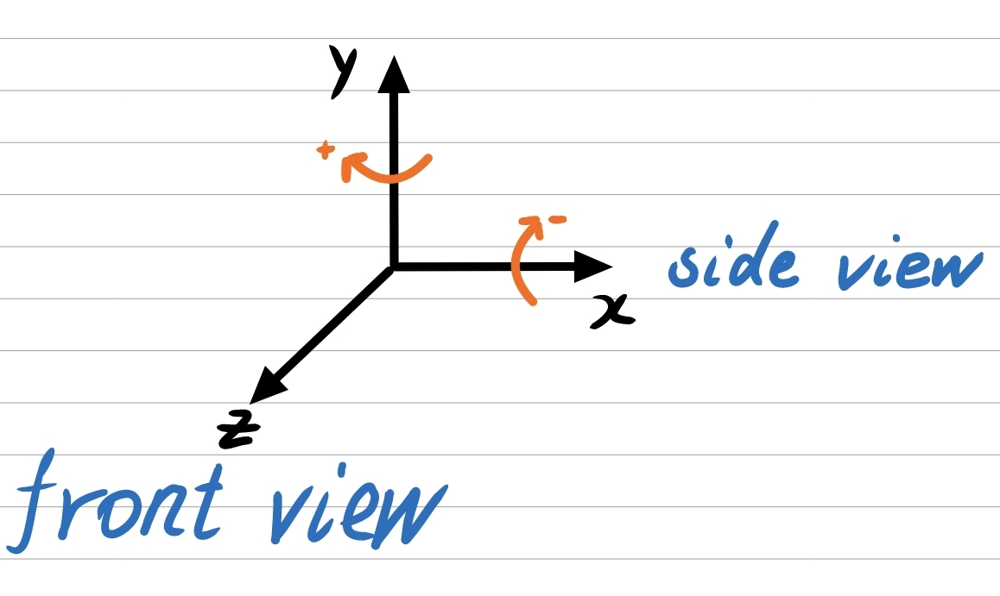

 # 
 StillFantasy3D 

# Update log
**Please pull the latest code to improve performance!!**
- (2023.09.11)
  - Note: pull the latest code of Fantasia3D and add 3Dmask and segment component.

# Coordinate System

